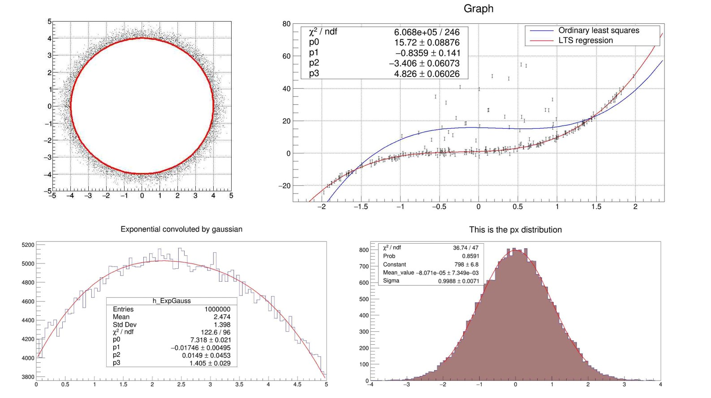
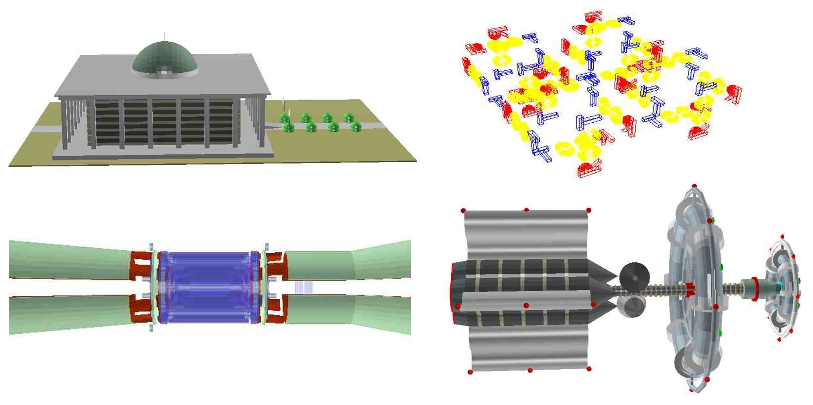
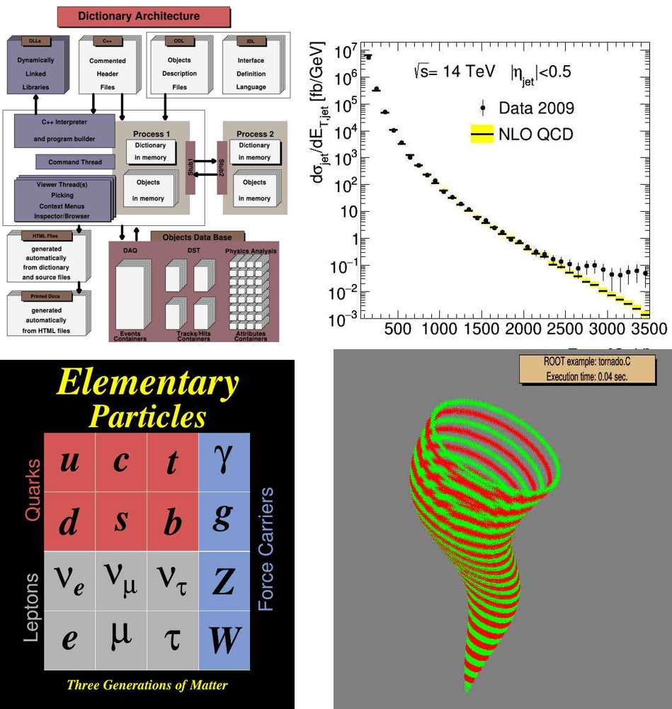
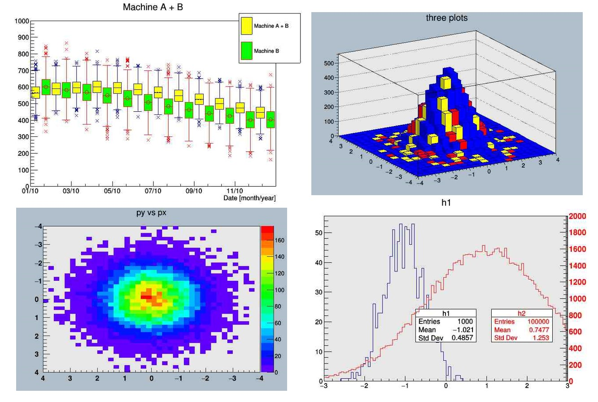
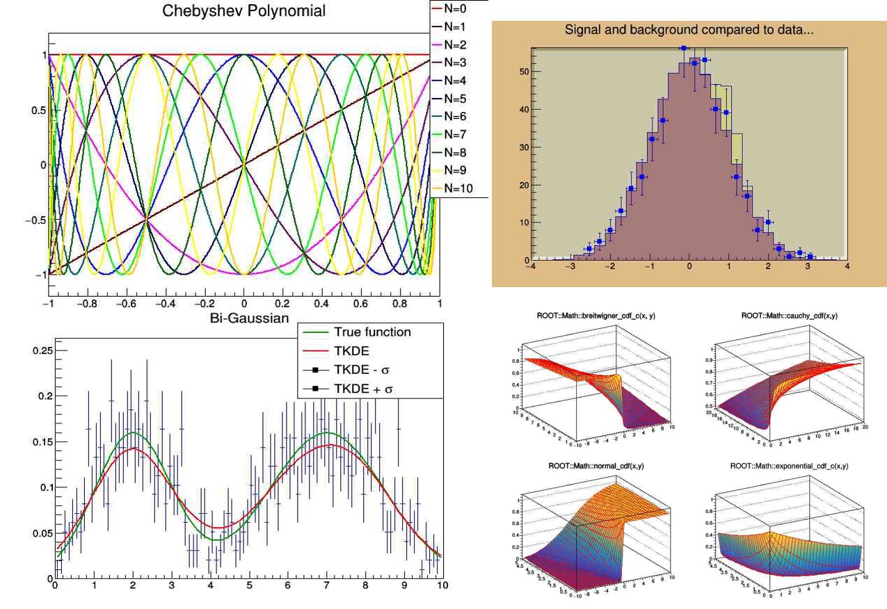
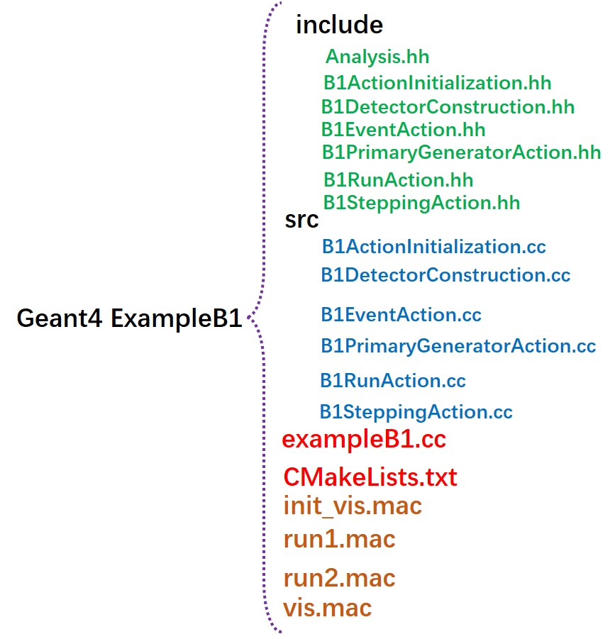
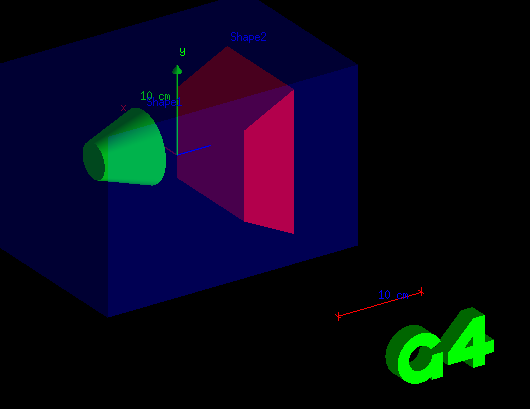
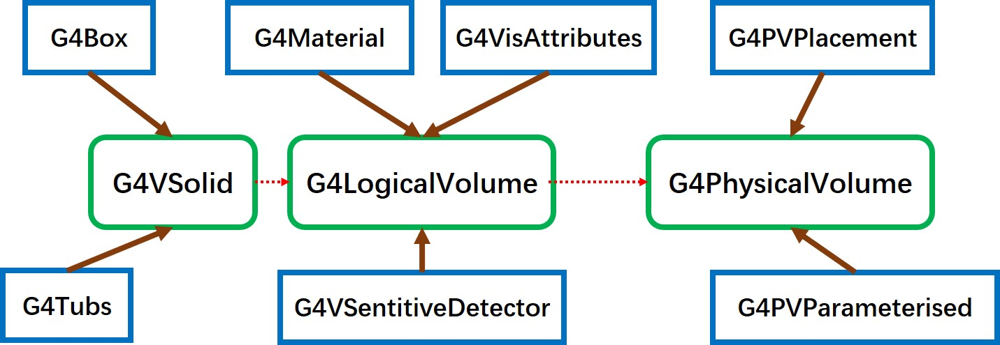
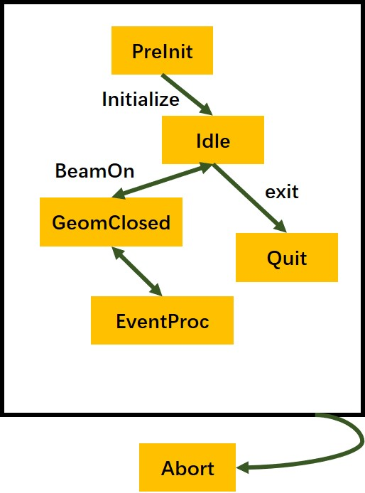
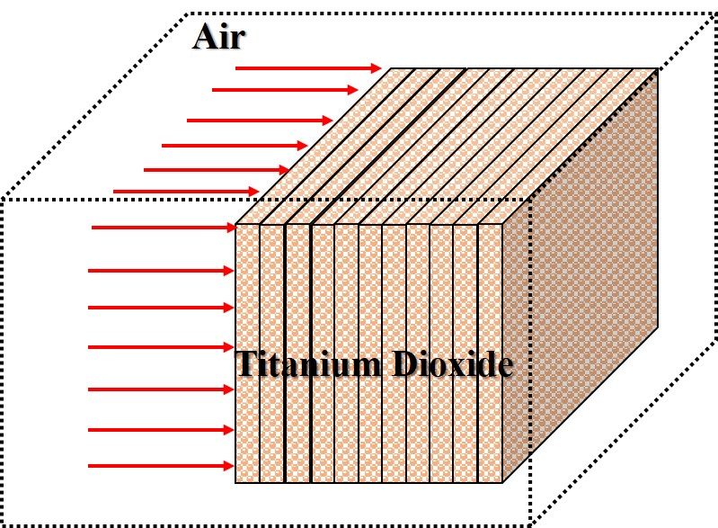

Simulations
===============
That has a paragraph about a main subject and is set when the '='
is at least the same length of the title itself.
 
ROOT-Data Analysis Framework
------------------------------
Root is a modular scientific software toolkit.It provides all the functionalities needed to
deal with big data processing,statistical analysis,visualisation and storage.It is mainly written
in C++ but integrated with other lanuages such as Python and R.

Installing the Root 
^^^^^^^^^^^^^^^^^^^^^^^

**Build Prerequisites**
This page lists the Prerequisites packages that need to be install on the Ubuntu systems where 
you can use the following commands.

Required packages:

sudo apt-get install git dpkg-dev cmake g++ gcc binutils libx11-dev libxpm-dev \
libxft-dev libxext-dev

Optional packages:

sudo apt-get install gfortran libss1-dev libpcre3-dev \
xlibmesa-glu-dev libglew1.5-dev libftg1-dev \
libmysqlclient-dev libfftw3-dev libcfitsio-dev \
graphviz-dev libavahi-compat-libdnssd-dev \
libldap2-dev python-dev libxml2-dev libkrb5-dev \
libgs10-dev libqt4-dev

1. Download the source code<https://root.cern.ch/downloading-root>
2. tar -zxvf root_v6.18.04.source.tar.gz
3. mkdir build(obj)
4. cd build(obj)
5. cmake ../root-6.18.04
6. make -j n
7. Add the path/build(obj)/bin.thisroot.sh to the .bashrc file and source .bashrc file

Getting started
^^^^^^^^^^^^^^^^^^

Root的基本语法可以参考官网，官网也是上手最快、获取帮助最直接的地方；此外大家记得将root目录下的tutorials
文件夹拷贝到特定的root学习文件夹，比如root_task目录下，因为这里面的好多例子是需要我们结合自己的
研究情况或者作图方式要时刻去参考的，大家要随时去查阅相关命令。具体的内容如下：

* **fft**:Fast Fourier Transform with the fftw package
* **fit**:Several examples illustrating minimization/fittting
* **foam**:Random generator in multi-dimensional space
* **geom**:Examples of use of the geometry package (TGeo classes)
* **gl**:Visulisation withOpenGL
* **graphics**:Basic graphics
* **graphs**:Use of TGraph,TGraphErrors,etc
* **gui**:Scripts to create Graphics User Interface
* **hist**:Histogram
* **image**:Image Processing
* **io**:Input/Output
* **math**:Maths and Statistica functions
* **matrix**:Matrices (TMatrix) examples
* **mlp**:Neural networks with TMultiLayerPerceptron
* **net**:Network classes (client/server examples)
* **physics**:LorentzVectors,phase space
* **pyroot**:python tutorials
* **pythia**:Example with pythia6
* **quadp**:Quadratic Programming
* **smatrix**:Matrices with a templated package
* **spectrum**:Peak finder,background,deconvolutions
* **splot**:Example of the TSplot class (Signal/background estimator)
* **sql**:Interfaces to SQL (mysql,oracle,etc)
* **thread**:Using threads
* **tree**:Creating Trees,Playing with Trees
* **unuran**:Interface with the unuran random generator library
* **xml**:Writing/Reading xml files

**Fit examples**

**Geometry examples**

**Graph examples**

**Histogram examples**

**Math examples**

好了接下来开始我们的root学习之旅，无论你学习root的出发点是什么，我相信它必定会变成你一款未来你爱不释手的
工具，接下来我主要重点讲解root应用的几个方面：

1. root脚本

一听到脚本是不是大家像我一样感到兴奋呢，无论是shell脚本、python脚本或者root脚本，反正我听到我就感觉上瘾了！
首先当你安装好root后，运行脚本的命令非常简单：
root -l script.C

是不是感觉很方便，你可以在script.C中安装C++的语法和root的基本语法，实现任何你想实现的东西，感觉自己又可以复习
C++了，那就简单编写一个：

.. code-block:: c
    :linenos:

    {
        cout<<"Hello ROOT"<<endl;
        int Num=5;
        for(int i=0;i<Num;i++)
        {
            cout<<"root i="<<i<<endl;
        }
    }

然后将上述文件保存为ex00.C后运行root -l ex00.C就会出现相应的结果。是不是非常简单，那就尝试编写更多的
root脚本文件开展工作吧。

Geant4 
----------
 
Geant4 is a Monte Carlo software toolkit to simulate the passage of particles through matter.
It is for detector simulation of research in **high energy physics**, **nuclear physics** and
**cosmic ray physics**.Also it is for application in **space science**, **radiological science** and
**radiation background calculation** etc.

Installation
^^^^^^^^^^^^^^^

#. First you should install the CMake.
#. And use the following commands to install the appropriate library: \
   sudo apt-get libgl1-mesa-dev libglu1-mesa-dev libxt-dev \
   libXmu-dev libXi-dev zlib1g-dev libgl2ps-dev \
   libexpat1-dev libxerces-c-dev.
#. Then you can download the Source files and Data library files.
#. First make a directory **Geant4** and make corresponding directories of **geant4-build** \
   **geant4-install** and **geant4-projects** to complie、install and run your geant4 projects; \
   then **tar -zxvf source.file** in the Geant4 directory.
#. cd geant4-build.
#. cmake -DCMAKE_INSTALL_PREFIX=/PATH/geant4-install -DGEANT4_USE_OPENGL_X11=ON \
   -DGEANT4_BUILD_MULTITHREADED=ON -DGEANT4_USE_RAYTRACER_X11=ON \
   -DGEANT4_USE_GDML=ON ../geant4.10.05.
#. make -jN.
#. make install.

.. note::
   In order to use the various Geant4 Libraries,we should add the **Geant4 Libraries**
   path to add into the **.bashrc** file,then you complete the installation.
   

1. 安装cmake.
2. 安装必须的库:
sudo apt-get libgl1-mesa-dev libglu1-mesa-dev libxt-dev \
libXmu-dev libXi-dev zlib1g-dev libgl2ps-dev \
libexpat1-dev libxerces-c-dev.
3. 下载安装文件，下载Source files 和 Data files.
4. 建立目录Geant4,并在目录下建立geant4-build,geant4-install,geant4-projects分别编译、运行和项目的目录，
然后将Source file解压在该文件目录下，最终文件目录结构如下
ant4--[geant4.10.05,geant4-build,geant4-install,geant4-projects].
5. cd geant4-build.
6. cmake -DCMAKE_INSTALL_PREFIX=/PATH/geant4-install -DGEANT4_USE_OPENGL_X11=ON \
-DGEANT4_BUILD_MULTITHREADED=ON -DGEANT4_USE_RAYTRACER_X11=ON \
-DGEANT4_USE_GDML=ON ../geant4.10.05.
7. make -jN.
8. make install.
9. 设置环境变量：为了可以使用Geant4 Library,我们需要设置相应的环境变量，将所有的Library文件路径添加到
系统环境变量中.

Getting started
^^^^^^^^^^^^^^^^
**Run examples**：接下来我们就可以运行Geant4提供的例子运行并学习修改，其中geant4.10.05/examples/里面的
basic中的例子最为简单，供入门学习，接下来我们先运行B1例子为例进行讲解：

1. 将B1例子拷贝到我们前面建立的geant4-projects中(对于后面的项目也类似)；
2. cd geant4-projects/example;
3. mkdir build;
4. cmake -DGeant_DIR=/path_to_geant4-install/lib/Geant4-10.5.0 ../;
5. make -jN;
6. ./example;

**编译器选择**：作为神器编译器，当然推荐Visual Studio Code了，当然安装也是非常简单的：

1. 下载.deb文件
2. sudo dpkg -i code_1.deb   
3. sudo apt-get -f install
4. 然后你就可以在应用程序中找到它了，打开后将你的项目文件导入进去就好.
5. 在你导入文件后，你会发现有许多报错语句#include" .hh",这是点击报错语句前的“小灯泡”，
选择Edit includePath Setting,这是打开c_cpp_properties.json文件，修改其中的“includePath",在后面添加
相应的头文件的路径就好."/home/day/materials/Geant4/geant4-projects/B1/include","/home/day/materials/Geant4/geant4-install/include/Geant4".

ExampleB1
""""""""""

In this section,I will describe the example B1 in detalis.If you want to learn the `CMake <https://cmake.org/>`_
tutorial systematiclly,you can refer to a very `useful tutorial <https://www.hahack.com/codes/cmake/>`_ for beginners  
which is  good information for your learnings.First let's have a look
at the directory structure which is same as the CMake C++ files.

It demonstrates a very simple but useful application where an energy deposit is accounted in 
user actions and their associated objects and a dose in a selected volume is calculated.When you
build and run the exampleB1,its model structure shows as follow:

.. note::
    In my opinion,you should regard the Geant4 simulations as a Cmake process which make you
    complie and run a whole C++ project and you should read the **main.cxx** file firstly.It can
    make you understood the program structure and learn the simulation process when you begin
    you Geant4 works.In the next moment,you need to change its geometry、physics lists and other
    events in the **src** directory.

Let's start our simulation,please pay attention to **main funtion** in your project directory at 
any time.You can get the Geant4 Simulation process from the **main function** and its initial
setting 、intermediate run and output results commands.Okay,Lets's have a look at **exampleB1.cc**:

.. literalinclude:: exampleB1.cc
    :language: c
    :linenos:

Geometry Definition
"""""""""""""""""""""""
When you start your research work,you should define a detector geometry firstly,a detector 
geometry in Geant4 is made of a number of volumes.The largest volume is called the **World**
volume.It must contain,with some margin,all other volumes in the detector geometry.The other
volumes are created and placed inside previous volumes,included in the World volume.The most
simple (and efficient) shape to describe the World is a box.

Each volume is created by describing its shape and its physical characteristics,and then placing
it inside a containing volume.When a volume is placed within another volume,we call the former
volume the daughter volume and the latter the mother volume.The coordinate system used to specify
where the daughter volume is placed,is the coordinate system of the mother volume.

To describe a volume's shape,we use the concept of a solid.A solid is a geometrical object that
has a shape and specific values for each of that shape's dimensions.To describe a volume's full
properties,we use a logical volume.It includes the geometrical properties of the solid,and adds
physical characteristics:the material of the volume;whether it contains any sensitive detector
elements;the magnetic field;etc.

And the following picture give a sense to define detector geometry, **G4VSolid** use to define
the simulation structure's shape and size, **G4LogicalVolume** give different volumes' dependency 
about daughter volums、materials、sentivity、user limits etc and  **G4VPhysicalVolume** give 
a full description of model's position and other messages(rotation).

Physics List
"""""""""""""""
Geant4 offers

1. Electromagnetic(EM) processes
2. Hadronic processes
3. Photo-hadron and lepto-hadron processes
4. Optical photon processes
5. Decay processes
6. Shower parameterization
7. Event biasing techniques
8. You can plug-in more

Action Intialization
""""""""""""""""""""""""

Primary Generator
"""""""""""""""""""

Detector Response
""""""""""""""""""""

Summary
""""""""""""

Project1:Energy Depositions subject
^^^^^^^^^^^^^^^^^^^^^^^^^^^^^^^^^^^^
In this project,I will show the dose/energy depositions distributions in the Titanium Dioxide
along the incident photon beam.And the simulation model is illustrated as following picture.

In this 

Project2: PKA spectrum 
^^^^^^^^^^^^^^^^^^^^^^^^

SomeNotes
^^^^^^^^^^^
We can use Geant4 examples to do the research workks and learns which is showed following 
paragraph.

**Basic examples**:These basic examples is oriented to beginners and covering many basic general
use-cases typical of an "application"-oriented kind of development.

1. ExampleB1

  * Simple geometry with a few solids using simple placements (G4PVPlacement)
  * Scoring **total dose** in a selected volume user action classes
  * Using G4Accumulable for automatic merging of scored values in multi-threading mode
  * Geant4 Physics list (QBCC)

2. ExampleB2

  * Simplified tracker geometry with global constant magnetic field
  * Geometry with simple placements (G4PVPlacement) and parameterisation (G4PVParameterisation)
  * Scoring within tracker via G4 **sensitive detector** and **hits**
  * Geant4 physiics list (FTFP_BERT) with step limiter

3. ExampleB3

  * Schematic Positron Emitted Tomography(PET) system
  * Geometry with simple placements with rotation (G4PVPlacement)
  * Radioative source
  * Scoring within **Crystals** via **G4 scores**
  * Using G4Accumulable for automatic merging of scored values in multi-threading mode (a) 
    and G4StatAnalysis for accumulating statistics (b)
  * Modular physics list built via builders provided in Geant4

4. ExampleB4

  * Simplified calorimeter with layers of two materials
  * Geometry with replica(复制-划分/分割) (G4PVReplica)
  * Scoring within layers in four ways: via **user action** (a),via **user own object** (b),
    via **G4 sensitive detector** and **hits** (c) and via **scores** (b)
  * Geant4 physics list (FTFP_BERT)
  * Histogram (1D) and ntuple saved in the output file

    
.. note::
    This is note text,when we use the **theParticleIterator** in Geant4 file,you should
    replace it with **auto theParticleIterator --> GetParticleIterator**.

.. warning::
    This is a warning text.Geant4 

Basics of Monte Carlo Simulation

 * Historical review of Monte Carlo methods
 * Basics of Monte Carlo method
 * Two Monte Carlo particle transport examples
 * Boosting Simulation
 * A partial list of Monte Carlo codes